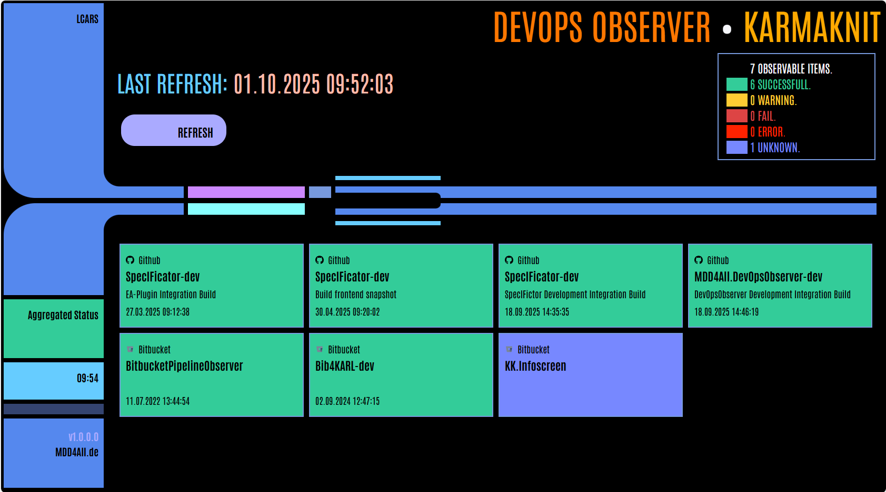

# The DevOps Observer

[](https://github.com/oalt/MDD4All.DevOpsObserver-dev/actions/workflows/devopsobserver-integration-dev-build.yml)

The DevOps Observer is a blazor-based app to monitor and display the status of different DevOps actions.
It shows, if a contineous integration operation was successfull or fails.

An aggregated status shows a resulting status. This means only if all of the monitored DevOps pipelines are successfull, the aggregated status is also successfull.



As a fan of Star Trek - The Next Generation (TNG), I have used an LCARS CSS theme (https://www.thelcars.com/) to style the view of the application.

The application also includes the control of a Phillips Hue bulb to show the aggregated status with a colored bulb in real hardware.

This repository contains the development solution (-dev). It uses git submodules to include the code of other libraries into the solution. So if you clone this repository, 
ensure that you clone the submodules too!

The application follows the MVVM design pattern and an Inversion of Controls (IoC) architecture.

## Configure the monitored projects

To define the monitored projects, a JSON file called `DevOpsConfiguration.json` is used. Edit this file and include your projects to be monitored there. 

Example:

```json
{
    "OrganizationTitle":  "Karmaknit",
    "Systems": [
        {
            "GUID": "36365013-02FA-414F-9050-31B4D3E651EB",
            "Name": "Github oalt",
            "ServerURL": "https://api.github.com",
            "Tenant": "oalt",
            "SystemType": 1,
            "ObservedAutomations": [
                {
                    "RepositoryName": "MDD4All.DevOpsObserver-dev",
                    "RepositoryBranch": "main",
                    "Alias": "MDD4All.DevOpsObserver-dev"
                }
            ]

        },
        ...
    ]
}
```

## API secrets
To authorize against the CI/CD systems and their APIs, the user secrets must be given. In the development project this is realized by the ``secrets.json`` file.

Example syntax: 

```json
{
    "36365013-02FA-414F-9050-31B4D3E651EB": {
        "ServerURL": "https://api.github.com",
        "LoginName": "oalt",
        "Password": "github_pat_YOUR_ACCESS_TOKEN"
    }
}
```